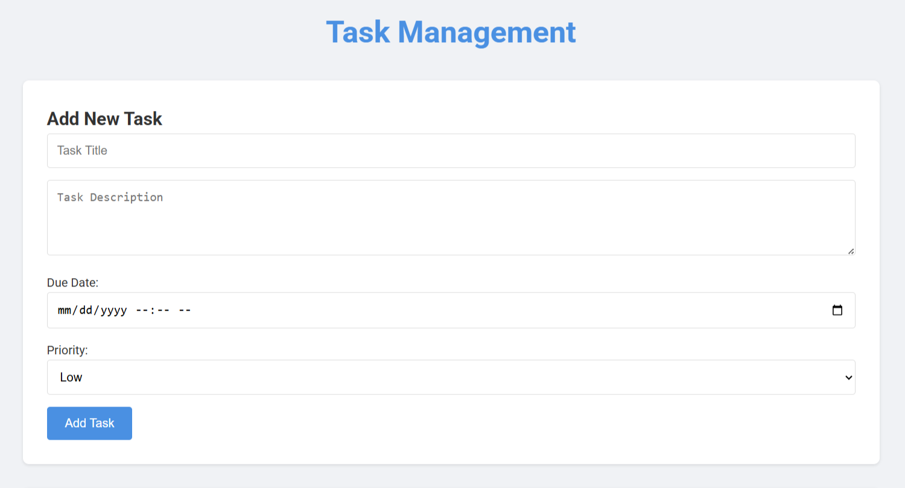
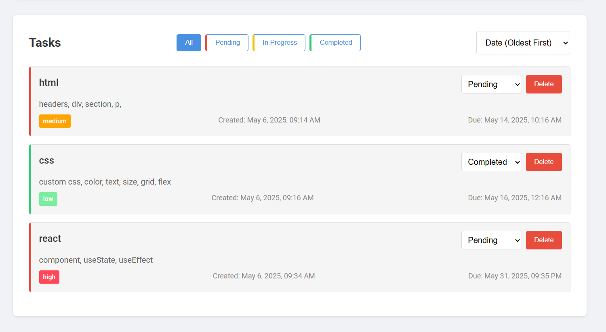

# 📝 Task Management App

A simple and responsive Task Management web application built using **HTML**, **CSS**, and **JavaScript**. This project allows users to manage tasks efficiently by adding, tracking, and updating their status in real-time.

## 🚀 Features

- Add new tasks with:
  - Title
  - Description
  - Due date and time
  - Priority (Low, Medium, High)
- View tasks in categories:
  - All
  - Pending
  - In Progress
  - Completed
- Filter tasks by:
  - Date (Oldest First)
- Delete tasks
- Responsive UI using Grid and Flexbox

## 📸 Screenshots

### 🔹 Task Input Form

### 🔹 Task List with Filters

## 🛠️ Tech Stack

- **HTML** – Structure
- **CSS** – Styling (Custom colors, grid/flex layouts, responsive design)
- **JavaScript** – Dynamic functionality (task addition, filtering, deleting)

